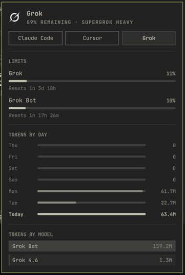
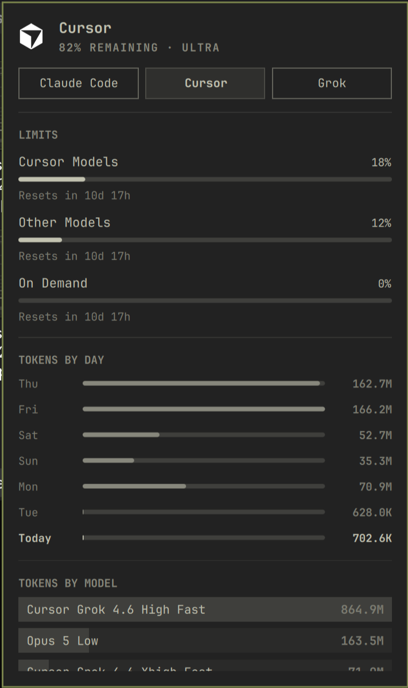

# SpaceXAI usage





Omarchy **service** plugin. It does not add a bar icon.

It writes Grok and Cursor usage records into
`~/.local/state/omarchy/agents/usage/` using the same JSON contract as the
stock Claude, Codex, and Fireworks collectors. The **Agents** panel
(`omarchy.agents`) already watches that directory, so the extra tabs appear
beside those subscriptions.

- **Grok** — SuperGrok weekly pool and Grok Bot weekly allowance
- **Cursor** — Cursor Models, Other Models, On Demand

## Why

Omarchy's stock Agents panel already covers Claude, Codex, and Fireworks.
I could not find a plugin that also showed **Grok Bot** (grokbot / grok-bot)
usage — remaining weekly allowance, reset time, and token totals — next to
those. I also wanted it **in that same Agents panel**, not a separate plugin,
panel, or bar icon, so it stays one place with the built-in collectors instead
of a second UI. This exists for that: Grok CLI and Grok Bot on one Grok tab,
Cursor on its own tab, written into `omarchy.agents`.

## Marketplace search

The Omarchy plugin catalog at [plugins.omarchy.org](https://plugins.omarchy.org/)
searches listing **name**, **description**, **id**, **author**, **category**,
**kind**, and the **one to three official tags** from the submit form. It does
not search this README, GitHub topics, or a free-form `grok bot` tag unless
reviewers add that tag to the catalog.

Official tags are a closed list (`ai`, `bar`, `quickshell`, …). Submit with:

- **Category:** Developer Tools
- **Tags:** `ai`, `quickshell`
- **Suggest a missing tag:** `grok bot`

The manifest `description` already contains `Grok`, `Grok Bot`, `grokbot`, and
`grok-bot`, so catalog searches for those strings match even if the extra tag
is not accepted.

Leave Agents on the bar.

Install:

```bash
omarchy plugin add https://github.com/jexmarc/spacexai-usage.git --enable
```

Or from a local checkout:

```bash
omarchy plugin enable spacexai-usage
```

Remove:

```bash
omarchy plugin disable spacexai-usage
omarchy plugin remove spacexai-usage --yes
```

Enabling this plugin does not change bar layout or overwrite `shell.json`
beyond adding the plugin to the enabled list. Disabling and removing it
stops the collector; it does not delete Claude/Codex/Fireworks usage files.

Each tab shows remaining quota from that product's authenticated usage stats
(the same numbers as Settings → Usage), plus the same tokens-by-day and
tokens-by-model sections as Claude Code. Grok's token totals combine Grok CLI
sessions with Grok Bot usage; the per-model breakdown uses Grok CLI models
and attributes Grok Bot tokens to Grok Bot. Cursor uses billed usage events.

## Credentials

Login tokens, cookies, and API keys are **not part of this repo**. They stay
in your home directory (`~/.grok/`, `~/.config/Grok Bot/`, `~/.cursor/`) and
are gitignored. Never commit those files.

The collector reads credentials already on this machine and only sends them
to the product's own usage API:

| Tab | Credential | Endpoint |
|---|---|---|
| Grok | `~/.grok/auth.json` (Grok CLI login) | `cli-chat-proxy.grok.com` |
| Grok Bot / Cursor | Grok Bot `sand-secrets.json` or `~/.cursor/auth.json` | `api2.cursor.sh` |

Tokens are never written into the Agents usage JSON, never printed, and never
sent anywhere else. Usage files are created mode `0600`. Preview screenshots
in this README are UI captures with no account name, email, or path.
